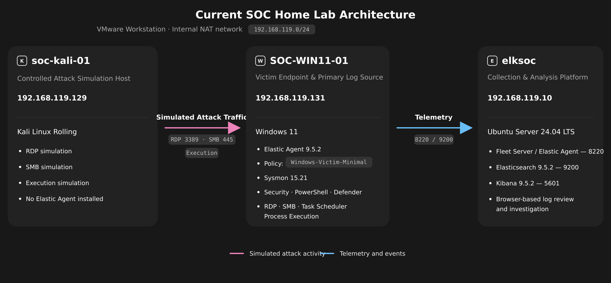
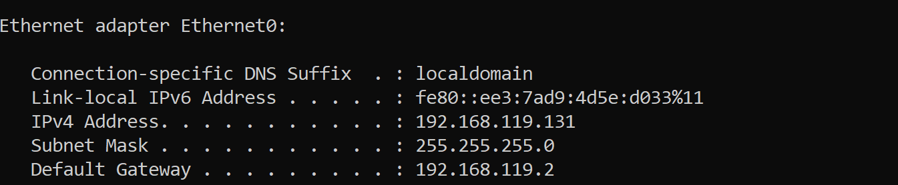
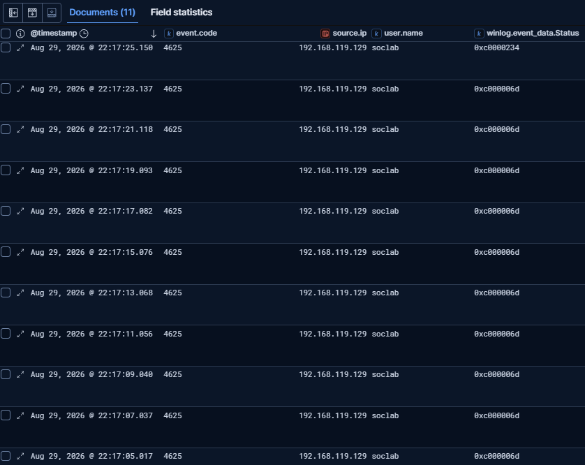
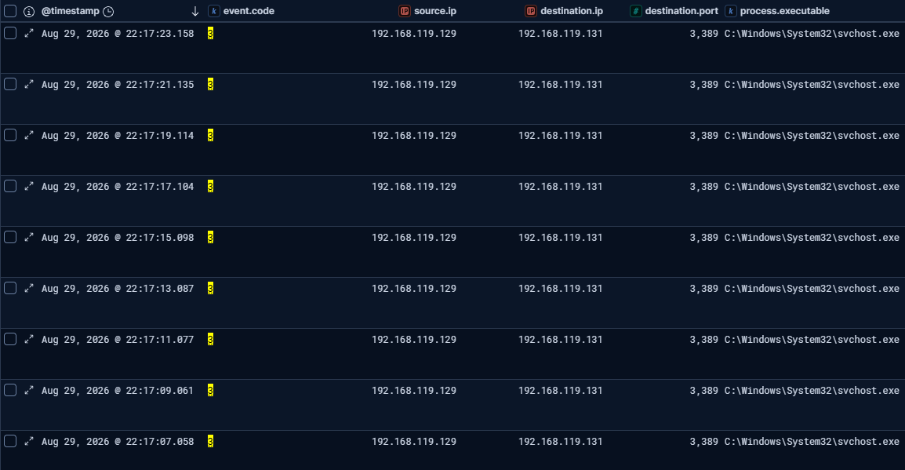
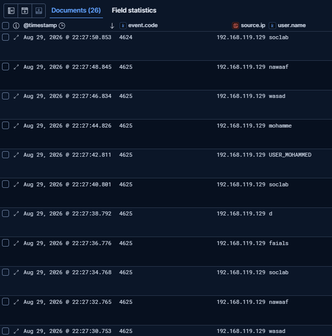
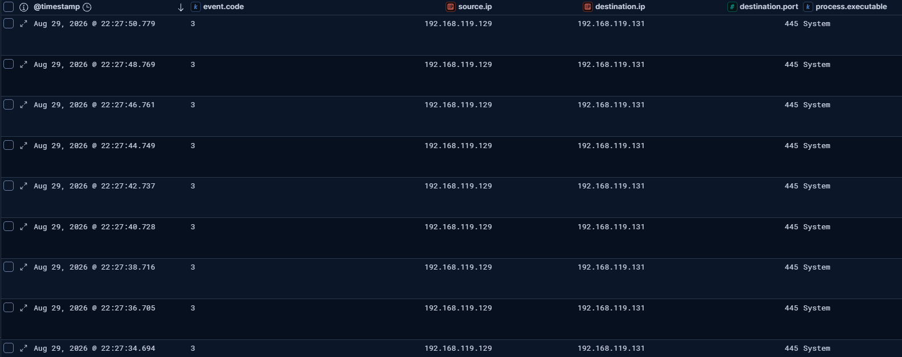
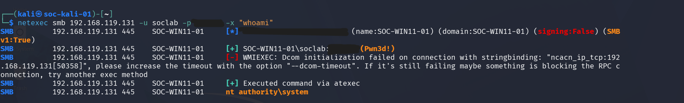
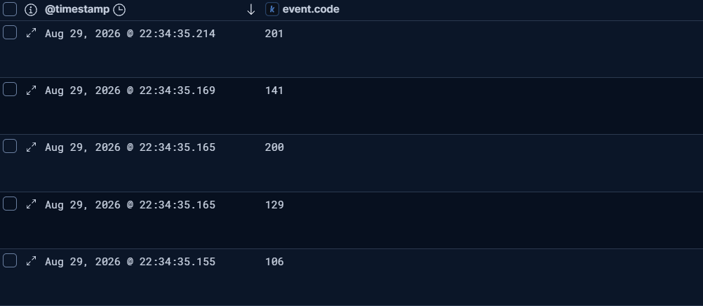
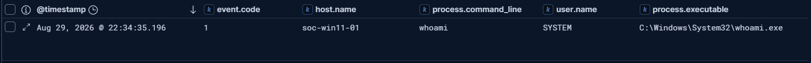
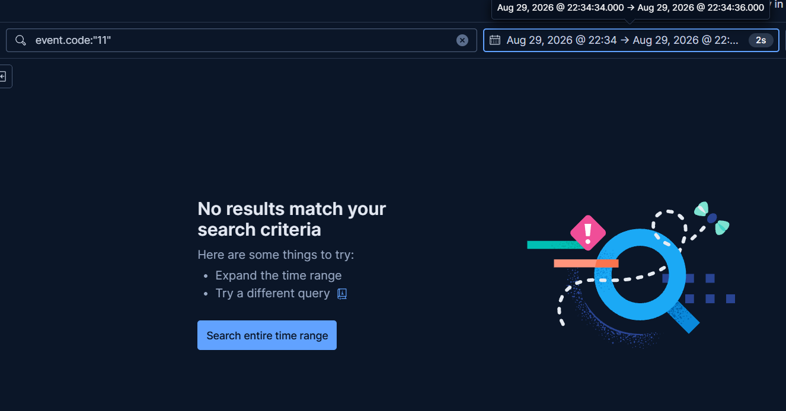

# Elastic SOC Home Lab: RDP, SMB, and Remote Execution Investigation

> A three-VM Blue Team lab documenting manual triage, event correlation, impact scoping, and escalation across a blocked RDP password-guessing attempt, successful SMB authentication, and controlled SYSTEM-level execution.


## Table of Contents

- [Overview](#overview)
- [Investigation at a Glance](#investigation-at-a-glance)
- [Architecture](#architecture)
- [Technology Stack](#technology-stack)
- [Lab Setup](#lab-setup)
- [Investigation Methodology](#investigation-methodology)
- [Investigation 1: RDP Password Guessing](#investigation-1-rdp-password-guessing)
- [Investigation 2: SMB Credential Attack](#investigation-2-smb-credential-attack)
- [Investigation 3: Scheduled-Task Execution](#investigation-3-scheduled-task-execution)
- [MITRE ATT&CK Mapping](#mitre-attck-mapping)
- [Detection Gaps and Open Items](#detection-gaps-and-open-items)
- [Skills Demonstrated](#skills-demonstrated)
- [Repository Structure](#repository-structure)
- [Future Work](#future-work)
- [Scope and Transparency](#scope-and-transparency)

## Overview

This project documents an Elastic-based SOC home lab built to practice investigation rather than only tool deployment. The lab follows a repeatable analyst workflow:

1. **Triage** authentication and execution activity in Kibana Discover.
2. **Correlate** Windows Security, Sysmon, and Task Scheduler telemetry.
3. **Scope** what the evidence proves—and what it does not prove.
4. **Assign a verdict** to each phase.
5. **Escalate impact** only when later evidence supports it.

The investigation deliberately contrasts three outcomes:

- RDP password guessing was stopped by account lockout, with no successful authentication.
- SMB authentication succeeded using a valid local account, confirming **account compromise**.
- After controlled lab-side privilege changes, remote execution succeeded through Task Scheduler as `NT AUTHORITY\SYSTEM`, confirming **host compromise** for that execution phase.

> [!IMPORTANT]
> No custom detection rule or alert is claimed in this repository. The findings were produced through manual searches and correlation in Kibana Discover.

## Investigation at a Glance

| Phase | Initial evidence | Correlation source | Outcome | Confirmed impact |
|---|---|---|---|---|
| RDP | 11 failed authentication documents over approximately 20.1 seconds | Sysmon network connections to TCP 3389 | Password guessing stopped by account lockout | No account or host compromise |
| SMB | 26 authentication documents across multiple tested usernames: 25 failures followed by 1 success for `soclab` | Sysmon network connections to TCP 445 | Simulated unauthorized authentication succeeded | Account compromise confirmed; host/data compromise not yet confirmed |
| Execution | Task registration, start, completion, and process creation within the same sub-second window | Task Scheduler Operational + Sysmon process creation | `whoami` executed as `NT AUTHORITY\SYSTEM` | Host compromise confirmed for the controlled execution phase |

### Evidence boundaries

- A successful network logon proves that a credential was accepted; it does not by itself prove command execution, persistence, or data access.
- SYSTEM-level execution was established only after correlating Task Scheduler activity with the process-creation event.
- The execution phase required deliberate lab-side configuration changes. It is not presented as an automatic privilege escalation caused by the SMB credential attack.

## Architecture

The environment uses VMware with the default NAT network `192.168.119.0/24`.

| Role | Hostname | Operating system | Resources | IP address |
|---|---|---|---|---|
| SIEM / Fleet / Kibana | `elksoc` | Ubuntu Server 24.04 LTS | 4 vCPU, 10 GB RAM, 155 GB disk | `192.168.119.10` |
| Victim endpoint | `SOC-WIN11-01` | Windows 11 | 4 vCPU, 8 GB RAM, 80 GB disk | `192.168.119.131` |
| Attack source | `soc-kali-01` | Kali Linux Rolling | 4 vCPU, 4 GB RAM, 79 GB disk | `192.168.119.129` |



*Figure 1 — Three-VM topology showing simulated attack traffic from Kali to Windows and telemetry flow from Windows to Elastic.*

> The victim IP was validated as `192.168.119.131`. An earlier note incorrectly recorded it as `192.168.119.130`; that superseded value is not used in this repository.

## Technology Stack

| Component | Version / configuration | Purpose |
|---|---|---|
| Elasticsearch | 9.5.2, native Debian-repository installation, HTTPS enabled | Event storage and search |
| Kibana | 9.5.2, exposed on TCP 5601 within the NAT network | Manual triage and investigation in Discover |
| Fleet Server | Elastic Agent 9.5.2, TCP 8220 | Centralized endpoint-agent management |
| Windows Elastic Agent | 9.5.2, policy `Windows-Victim-Minimal`, namespace `soclab` | Windows event forwarding |
| Sysmon | 15.21, service `Sysmon64` | Process, network, and selected file/persistence telemetry |
| VMware | Three virtual machines on NAT | Controlled virtual lab environment |
| Kali tools | `hydra` 9.7, `netexec`, `nmap` | Controlled activity generation and connectivity validation |

The Fleet Server and Windows agent were validated as healthy and connected. Elasticsearch used a 4 GB JVM heap, and the Fleet output pointed to the Elasticsearch service over HTTPS.

## Lab Setup

### Windows services exposed inside the lab

| Service | Port | Lab status |
|---|---:|---|
| OpenSSH Server | 22/TCP | Reachable from Kali through a Private-profile firewall rule |
| SMB | 445/TCP | Reachable from Kali during the validated test |
| RDP | 3389/TCP | Reachable from Kali during the validated test |

### Windows audit coverage

The following audit areas were enabled, using Success and Failure where stated in the source notes:

- Credential Validation
- Logon
- Account Lockout
- Special Logon — Success only
- Other Logon/Logoff Events
- User Account Management
- Security Group Management
- File Share
- Detailed File Share
- Other Object Access Events

Security-log process creation was deliberately disabled because Sysmon process telemetry supplied richer fields. Windows Filtering Platform connection auditing was also disabled in favor of Sysmon network telemetry.

<details>
<summary><strong>Collected Windows event codes</strong></summary>

Application events were limited to Critical and Error. The Security and System datasets collected the following event codes:

```text
Security
1102,4624,4625,4648,4672,4697-4702,4719,4720,4722-4726,4732,4733,4740,4776,5140,5145

System
41,104,1074,6005,6006,7040,7045
```

</details>

### Sysmon coverage

The Sysmon configuration file was stored at:

```text
C:\ProgramData\Sysmon\sysmon-elastic.xml
```

The configuration collected:

- Process creation
- Network connections only when the destination port was 22, 445, or 3389
- CreateRemoteThread activity
- High-risk access to `lsass.exe`
- File creation in Downloads, Public, Startup, and script-related paths
- Registry persistence locations such as Run, RunOnce, Winlogon, and IFEO
- Alternate data stream hashes
- WMI activity
- Process tampering
- Sysmon state and error events

DNS, image-load, raw-read, pipe, and routine process-termination telemetry were excluded to reduce volume. The file-creation path restriction later produced a measurable telemetry gap.

PowerShell Script Block Logging was enabled and collected:

```text
Event ID 4104
```

Invocation and module logging were not collected.

<details>
<summary><strong>Account lockout policy used for the clean RDP run</strong></summary>

```powershell
net accounts /lockoutthreshold:10
net accounts /lockoutduration:30
net accounts /lockoutwindow:30
```

Before the validated run, the previously locked `soclab` account was re-enabled and its bad-password counter was reset:

```powershell
net user soclab /active:yes
$user = [ADSI]"WinNT://SOC-WIN11-01/soclab,user"
$user.Put("BadPasswordCount", 0)
$user.SetInfo()
```

</details>

<details>
<summary><strong>Network troubleshooting and firewall note</strong></summary>

The Windows Firewall was temporarily disabled as a diagnostic step after Kali-to-Windows connectivity failed despite both systems having valid addresses on the same subnet. Connectivity and SMB testing worked after the change, indicating that SMB/ICMP-related firewall rules were the blocker.

The source notes recommended re-enabling the firewall and permitting only the required rule groups, but did not confirm that these re-hardening steps were executed:

```powershell
netsh advfirewall set allprofiles state on
netsh advfirewall firewall set rule group="File and Printer Sharing" new enable=yes
netsh advfirewall firewall set rule group="Core Networking - ICMP Echo" new enable=yes
```

The initial SMB module used by `hydra` continued to return an invalid-reply error against Windows 11. The workflow moved to `netexec`, which produced clear failure and success results.

</details>

<details>
<summary><strong>Optional setup evidence</strong></summary>



*Figure 2 — Windows IP configuration confirming `192.168.119.131/24` and gateway `192.168.119.2`.*

</details>

## Investigation Methodology

| Stage | Analyst question | Evidence used in this lab |
|---|---|---|
| Triage | What happened, when, to which account, and from which source? | Windows authentication events in Kibana Discover |
| Correlation | Does another telemetry source support the same activity? | Sysmon network telemetry, Task Scheduler Operational events, and Sysmon process creation |
| Scoping | Was access successful? Was execution observed? What remains unproven? | Failed-versus-successful logons, destination ports, task lifecycle, and command-line evidence |
| Verdict | Is the activity a true or false positive, and was the control effective? | Phase-specific evidence and the absence or presence of successful authentication/execution |
| Escalation | Does later evidence increase the confirmed impact? | Transition from failed RDP, to SMB account access, to controlled SYSTEM execution |

The lab owner executed each test, searched the Elastic data, and interpreted the results before reviewing field-name hints or explanations. This was intended to practice analyst reasoning rather than reproduce a predetermined checklist.

## Investigation 1: RDP Password Guessing

### Scenario

The clean RDP test used a custom password list containing only incorrect values so the test could validate account lockout without accidentally authenticating.

The custom wordlist was stored at:

```text
/tmp/rdp_wrong.txt
```

The controlled test command was:

```bash
hydra -l soclab -P /tmp/rdp_wrong.txt rdp://192.168.119.131 -t 1
```

### Triage

Kibana Discover filter:

```kql
event.code:4625 AND user.name:"soclab"
```

Relevant authentication event code:

```text
Windows Security Event ID 4625
```

| Measurement | Validated result |
|---|---|
| Total documents | 11 |
| Wrong-password status | 10 events with `0xc000006d` |
| Locked-account status | 1 event with `0xC0000234` |
| First observed event | 22:17:05.017 |
| Final lockout event | 22:17:25.150 |
| Duration | Approximately 20.1 seconds |
| Approximate rate | 32.8 attempts/minute |
| Successful authentication | None found for this session |



*Figure 3 — Kibana showing the complete 11-document RDP dataset: ten wrong-password results followed by the locked-account status.*

### Correlation

Relevant Sysmon event code:

```text
Sysmon Event ID 3 — Network Connection
```

| Field | Observed value |
|---|---|
| Source IP | `192.168.119.129` |
| Destination IP | `192.168.119.131` |
| Destination port | `3389` |
| Process executable | `svchost.exe` |
| Connections visible in screenshot | 9 |
| Visible connection window | 22:17:07.058–22:17:23.158 |

Full observed executable path:

```text
C:\Windows\System32\svchost.exe
```

The network events aligned with the failed-authentication timeline within roughly one second per event, which is consistent with normal network-versus-authentication logging delay in this dataset.



*Figure 4 — Nine visible Sysmon network connections from Kali to the Windows RDP service during the failed-authentication window.*

### Scope and verdict

**Verdict:** True Positive.

The activity was a password-guessing attempt, and the account lockout policy stopped it before successful authentication. No successful logon was found for this session. Therefore:

- Account compromise: **Not confirmed**
- Host compromise: **Not confirmed**
- Control outcome: **Account lockout worked as intended**

## Investigation 2: SMB Credential Attack

### Scenario

After the RDP contrast case, SMB authentication was tested using built-in Kali username and password lists:

```text
/usr/share/wordlists/users2.txt
/usr/share/wordlists/passwords2.txt
```

```bash
netexec smb 192.168.119.131 -u /usr/share/wordlists/users2.txt -p /usr/share/wordlists/passwords2.txt
```

### Triage

Relevant authentication event codes:

```text
Windows Security Event ID 4625 — Failed Logon
Windows Security Event ID 4624 — Successful Logon
```

The validated 26-document view contained authentication attempts across multiple usernames. Names visible in the evidence included `nawaaf`, `wasad`, `mohamme`, `USER_MOHAMMED`, `soclab`, `d`, and `faials`. Keeping the username column visible showed the transition from repeated failures across candidate credentials to a successful logon for `soclab`.

| Measurement | Validated result |
|---|---|
| Total authentication documents | 26 |
| Failed logons | 25 |
| Successful logons | 1 |
| Successful account | `soclab` |
| Successful timestamp | 22:27:50.853 |
| Latest failed attempt before success | `nawaaf` at 22:27:48.845 |
| Earliest confirmed timestamp seen while scrolling | 22:27:00.528 |
| Duration | Approximately 50 seconds; the true first row was not fully verified |
| Logon type | 3 — Network |
| Authentication package | NTLM |
| Source IP | `192.168.119.129` |



*Figure 5 — Kibana showing 26 SMB authentication documents across multiple usernames, ending in a successful network logon for `soclab`.*

### Correlation

Relevant Sysmon event code:

```text
Sysmon Event ID 3 — Network Connection
```

| Field | Observed value |
|---|---|
| Source IP | `192.168.119.129` |
| Destination IP | `192.168.119.131` |
| Destination port | `445` |
| Process executable | `System` |
| Connections visible in screenshot | 9 |
| Visible connection window | 22:27:34.694–22:27:50.779 |

The network activity closely matched the authentication timeline and supported the source/destination/service relationship.



*Figure 6 — Nine visible Sysmon network connections from the Kali source to TCP 445 on the Windows endpoint; the recorded executable value is `System`.*

### Scope and verdict

**Verdict:** True Positive.

The Windows endpoint accepted a valid local credential during the controlled simulation of an unauthorized SMB network logon. At this point, the evidence established:

- Account compromise: **Confirmed**
- Host compromise: **Not yet confirmed**
- Data access or exfiltration: **Not confirmed**
- Command execution: **Not yet confirmed**

The distinction matters: a successful authentication event alone does not prove that the endpoint was controlled or that data was accessed.

## Investigation 3: Scheduled-Task Execution

### Controlled lab precondition

Remote execution did not initially return command output. To enable a controlled execution test, the lab owner deliberately:

1. Added `soclab` to the local Administrators group.
2. Changed the UAC remote-token-filtering policy for local administrator network logons.

```powershell
net localgroup Administrators soclab /add
New-ItemProperty -Path HKLM:\SOFTWARE\Microsoft\Windows\CurrentVersion\Policies\System -Name LocalAccountTokenFilterPolicy -Value 1 -PropertyType DWORD -Force
```

> [!CAUTION]
> These were lab-side enablement changes, not privileges obtained automatically from the SMB password attack. The execution result must be interpreted within that controlled setup.

### Execution test

The public documentation redacts the lab password while preserving the tested command structure:

```bash
netexec smb 192.168.119.131 -u soclab -p '<LAB_PASSWORD_REDACTED>' -x "whoami"
```

The tool first attempted WMI-based execution, which failed with a DCOM/RPC initialization error. It then automatically fell back to Task Scheduler–based execution through `atexec`, which succeeded and returned:

```text
nt authority\system
```

The target is authoritatively documented as Windows 11. The raw `netexec` banner identified it as `Windows 10 Pro 26200`; that banner is retained only as tool output and is not used as the operating-system source of truth.



*Figure 7 — Original NetExec terminal output showing accepted SMB credentials, the observed WMI failure, `atexec` fallback, and SYSTEM-context execution. The lab password is redacted.*

<details>
<summary><strong>How atexec-style execution works</strong></summary>

At a high level, the documented mechanism is:

1. Authenticate to SMB with a valid administrative credential.
2. Write a temporary command file through an administrative share, commonly associated with locations such as:

   ```text
   ADMIN$
   C:\Windows
   ```

3. Register a one-shot scheduled task through the Task Scheduler service.
4. Allow the scheduler service to execute the task as `NT AUTHORITY\SYSTEM`.
5. Read the command output over SMB and remove the temporary task and file.

The administrative account requests task creation; the Windows scheduler service executes the task. This explains why the returned identity is SYSTEM rather than `soclab`.

The temporary-file location was not directly observed in this session. The mechanism above describes the expected `atexec` workflow; the confirmed evidence in this lab is the task lifecycle and correlated process creation.

</details>

### Task Scheduler correlation

Kibana Discover query:

```kql
winlog.channel:"Microsoft-Windows-TaskScheduler/Operational"
```

Relevant Task Scheduler event codes:

```text
106 — Task Registered
129
200 — Task Started
141
201 — Task Completed
```

| Timestamp | Observation |
|---|---|
| 22:34:35.155 | Task registered |
| 22:34:35.165 | Supporting scheduler event |
| 22:34:35.165 | Task started |
| 22:34:35.169 | Supporting scheduler event |
| 22:34:35.214 | Task completed |

The confirmed registration-to-completion sequence finished in well under one second.



*Figure 8 — The confirmed five-event Task Scheduler lifecycle at 22:34:35, displayed from newest to oldest.*

### Process-creation correlation

Kibana Discover query, with the time range narrowed to 22:34:35:

```kql
event.code:1
```

Relevant Sysmon event code:

```text
Sysmon Event ID 1 — Process Creation
```

One matching process event was observed:

| Field | Observed value |
|---|---|
| Timestamp | 22:34:35.196 |
| Host | `soc-win11-01` |
| Process command line | `whoami` |
| User | `SYSTEM` |
| Executable | `whoami.exe` |
| Correlation | Occurred after task start at 22:34:35.165 and before task completion at 22:34:35.214 |

Full observed executable path:

```text
C:\Windows\System32\whoami.exe
```



*Figure 9 — Original Kibana evidence showing Sysmon process creation for `whoami` under `SYSTEM` at 22:34:35.196, within the confirmed task-execution window.*

### Scope and verdict

**Verdict:** True Positive.

The Task Scheduler lifecycle, Sysmon process creation, and returned SYSTEM identity collectively confirmed command execution at the highest Windows OS privilege level. Within the controlled conditions of this phase:

- Account compromise: **Previously confirmed through SMB authentication**
- Command execution: **Confirmed**
- Execution context: **`NT AUTHORITY\SYSTEM`**
- Host compromise: **Confirmed for the controlled execution phase**
- Persistence beyond the one-shot task: **Not confirmed**
- Data access or exfiltration: **Not confirmed**

### Escalation summary

The evidence chain progressed from **accepted SMB credentials** to **correlated SYSTEM-level command execution**. This is the point at which the incident scope changed from account compromise to host compromise. The escalation statement is tied to the execution evidence and the documented lab preconditions—not to the successful network logon alone.

## MITRE ATT&CK Mapping

| Phase | Technique | Technique ID | Evidence status |
|---|---|---|---|
| RDP | Brute Force: Password Guessing | `T1110.001` | Confirmed attempt; stopped by account lockout |
| SMB | Brute Force: Password Guessing | `T1110.001` | Confirmed and successful |
| SMB | Valid Accounts | `T1078` | Confirmed |
| Execution | Scheduled Task/Job | `T1053` | Confirmed through Task Scheduler telemetry; behavior is consistent with `atexec`-style execution |

The mapping intentionally retains `T1053` exactly as validated in the source notes and does not claim a more specific sub-technique that was not formally recorded there.

## Detection Gaps and Open Items

Detection gaps are documented as analysis outcomes: they identify where telemetry or investigation scope should be strengthened next.

### 1. Temporary-file creation was outside Sysmon coverage

Relevant Sysmon event code:

```text
Sysmon Event ID 11 — File Creation
```

Query used in the same execution window:

```kql
event.code:"11"
```

The search returned zero matches. The Sysmon configuration only monitored file creation under:

```text
Downloads
Public
Startup
script-related paths
```

The temporary file used by `atexec` is expected outside this restricted list, commonly under an administrative-share or Windows location. Task Scheduler plus Sysmon process-creation correlation acted as a compensating source and still confirmed execution.



*Figure 10 — The file-creation query returned no results from `Aug 29, 2026 @ 22:34:34.000` to `Aug 29, 2026 @ 22:34:36.000`.*

### 2. A second Task Scheduler sequence remains unexplained

A near-identical task sequence appeared around **22:33:58**. It was not investigated far enough to determine whether it came from an earlier command run, a duplicate action, or another cause. It remains an open investigation item rather than being labeled benign.

### 3. The exact SMB start time remains unverified

The earliest timestamp reached while scrolling was **22:27:00.528**, but it was not confirmed as the first event in the 26-document dataset. The SMB duration is therefore reported as **approximately 50 seconds**, not as an exact measurement.

### 4. Detection engineering is future work

This project demonstrates manual discovery and evidence correlation. It does not claim that a formal detection rule or alert was built or validated. Turning the observed patterns into tested Elastic detections is a next step.

## Skills Demonstrated

- Deploying and validating Elasticsearch, Kibana, Fleet Server, and Elastic Agent in a three-VM NAT home lab
- Configuring focused Windows event collection and Sysmon telemetry
- Triaging authentication activity in Kibana Discover
- Correlating authentication, network, scheduled-task, and process telemetry
- Distinguishing blocked activity, account compromise, and host compromise based on evidence
- Scoping unconfirmed impact without overstating the result
- Mapping validated behaviors to MITRE ATT&CK
- Identifying telemetry gaps and documenting compensating evidence
- Producing an escalation narrative from Triage → Correlation → Scoping → Verdict → Escalation

## Repository Structure

```text
elastic-soc-home-lab/
├── README.md
├── images/
│   ├── architecture/
│   │   └── soc-lab-topology.png
│   ├── setup/
│   │   └── windows-victim-ipconfig.png
│   ├── rdp/
│   │   ├── rdp-failed-logons-and-lockout.png
│   │   └── rdp-sysmon-network-correlation.png
│   ├── smb/
│   │   ├── smb-authentication-sequence.png
│   │   └── smb-sysmon-network-correlation.png
│   ├── execution/
│   │   ├── netexec-atexec-system-execution.png
│   │   ├── task-scheduler-event-sequences.png
│   │   └── sysmon-whoami-process-creation.png
│   └── detection-gaps/
│       └── sysmon-file-creation-no-results.png
```

This tree reflects the files included in the current repository package. Dedicated investigation documents and configuration exports can be added later after review and removal of sensitive values.

## Future Work

- Investigate and explain the second Task Scheduler sequence around 22:33:58.
- Expand Sysmon file-creation coverage to include the relevant administrative-share/Windows temporary-file locations, then repeat the execution test.
- Confirm the exact first SMB authentication timestamp and replace the approximate duration with an exact measurement.
- Build and validate Elastic detection rules for repeated authentication failures, success after failures, and rapid scheduled-task execution.
- Verify and document Windows Firewall re-hardening after lab testing.
- Move full investigation timelines and supporting evidence into the proposed `docs/` files while keeping this README recruiter-friendly.

## Scope and Transparency

- The validated clean-run data in this README supersedes earlier test runs and incorrect historical notes.
- All timestamps are shown as they appeared in Kibana Discover, with Windows and Kali configured for `Asia/Riyadh`.
- Fleet, Sysmon, and audit-policy configuration were completed with assistance from an AI tool. The Elastic Stack installation, controlled test execution, log searches, and investigation analysis were performed directly by the lab owner.
- The credential shown in the raw working notes is intentionally redacted from this public README.
- The lab exists for controlled defensive learning. Findings are limited to the evidence collected in this environment.

---
